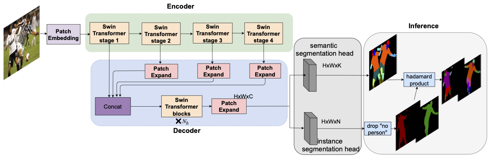

# HPSP

### This is an offical implementation for HPSP


In this repository, we release the HPSP code in Pytorch.

- HPSP architecture
<p></p>


### Environments
- Pytorch 1.7.1
- Cuda 10.1


### Installation
```
pip install -r requirements.txt
```

### Dataset
  Make sure to put the files as the following structure:

  ```
 
  ├─datas
  │  ├─CIHP 
  │  │  ├─Training
  │  │  │  ├─Categories
  │  │  │  ├─Categoriy_ids
  │  │  │  ├─Human
  │  │  │  ├─Human_ids
  │  │  │  ├─Instances
  │  │  │  ├─Instance_ids
 │  │  │
  │  │  ├─Validation
  │  │  │  ├─Categories
  │  │  │  ├─Categoriy_ids
  │  │  │  ├─Human
  │  │  │  ├─Human_ids
  │  │  │  ├─Instances
  │  │  │  ├─Instance_ids
   ```

### Results and Models

**HPSP On CIHP**

|  Backbone  | mIoU | APp/APp50/PCP50 |
|:----------:|:----:|:---------------:|
|  ResNet50  | 63.2 | 50.1/58.2/58.4  |
|  ResNet101 | 64.3 | 52.0/61.2/61.4  |
|  Swin-L    | 69.1 | 55.0/65.4/64.4  |

**HPSP On MHP-v2**

|  Backbone  | mIoU | APp/APp50/PCP50 |
|:----------:|:----:|:---------------:|
|  ResNet50  | 42.1 | 45.4/40.0/46.8  |
|  ResNet101 | 42.9 | 45.8/41.3/47.7  |
|  Swin-L    | 46.5 | 48.6/48.6/52.5  |


### Train

```
sh train_hpsp.sh
```


### Evaluation
#### CIHP
```
python eval_cihp_a100.py --backbone $backbone --checkname  $path_to_savedmodel
```
#### MHP-v2
```
python eval_mhp_a100.py --backbone $backbone --checkname  $path_to_savedmodel
```
